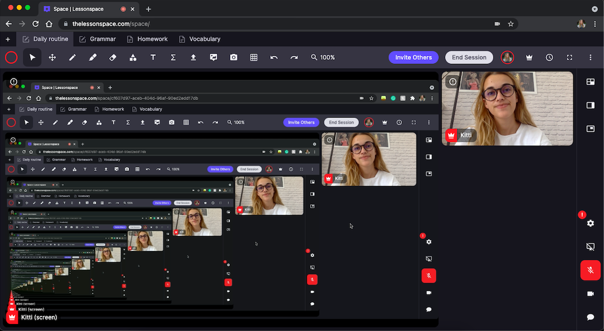

# Recursão

---
## Recursão
Um objeto é denominado recursivo quando sua definição é **parcialmente** feita em termos dele
mesmo.

---



---
# Recursão
A recursividade é muito encontrada na matemática através das funções recorrentes. **Ex.: fibonacci, fatorial**.

---
## Recursão em Programação
É um mecanismo que permite a uma função
chamar a si mesma.

---
## Pra que ?

---
## Estratégia Recursiva
> Diminuir sucessivamente o problema em um problema menor até que a simplicidade do problema reduzido permita resolvê-lo de forma direta (sem recursão).

---
## Estratégia Recursiva
> A resolução da função implica uma resolução anterior da função para outro valor.

---
## Estratégia Recursiva
> Para que a função tenha uma resolução final, é necessário existir um valor para o qual a função seja definida sem recursão. Chamamos este valor de **ponto de parada**.

---
## Semelhanças com Indução
> Na indução matemática primeiro prova-se um teorema para um valor base $n$. Em seguida, prova-se que o teorema é verdadeiro para todo $n + 1$.

---
## Exemplo de Função Simples
$$
f(x) = 10x + 2
$$

---
## Exemplo de Função Recorrente

$$
\begin{cases}
r(x) = 10 \cdot r(x - 1) \text{, se }  x > 1 \\ \\
r(x) = 1 \text{, se } x = 1
\end{cases}
$$

---
> Esta abordagem sobre funções recorrentes se assemelha muito com a recursividade na programação.

---
## Funções Recursivas
Alguns exemplos **clássicos** de função recursiva.

---
## Sequência de Fibonacci
$$
\begin{cases}
fib(n) = fib(n - 1) + fib(n - 2) \text{ , se } n > 1 \\ \\
fib(1) = 1 \\ \\
fib(0) = 0
\end{cases}
$$

---
## Fatorial
$$
\begin{cases}
n! = n \cdot (n -1)! \text{ , se } n > 0 \\ \\
0! = 1
\end{cases}
$$

---
## Potência
$$
\begin{cases}
x^n = x \cdot x^{n - 1} \text{ , se } n > 0 \\ \\
x^0 = 1
\end{cases}
$$

---
## Multiplicação
$$
\begin{cases}
x \cdot y = x +  x \cdot (y - 1) \text{ , se } y > 0 \\ \\
x \cdot 0 = 0
\end{cases}
$$

---
## Funções Recursivas

---
## Fibonacci
```python
def fib(n):

  if(n == 1):
    return 1
  elif (n == 0):
    return 0
  else:
    return fib(n - 1) + fib(n - 2)
```

---
## Fatorial
```python
def fatorial(n):
  
  if(n == 0):
    return 1

  return n * fatorial(n - 1)
```
---
## Equivalência Iterativa
> Todo algoritmo recursivo tem um equivalente iterativo.

---
## Equivalência Iterativa
> Porém nem sempre é simples criar um algoritmo iterativo para um problema recursivo complexo.

---
## Fatorial Iterativo

```python
def fatorial(n):

  resultado = 1

  for i in range(n, 0, -1):
    resultado *= i

  return resultado
```

---
## Tradeoffs
> Os algoritmos recursivos são mais simples de entender, se aproximam muito da própria definição da função recorrente.

---
## Tradeoffs
> No entanto os algoritmos recursivos utilizam muito recurso computacional (em especial a pilha de chamadas), tornando-os mais lentos que a sua contrapartida iterativa.

---
## Tradeoffs
> Já os algoritmos iterativos são mais eficientes (utilizam menos recurso computacional).

---
## Tradeoffs
> No entanto nem sempre é trivial obter uma versão iterativa de um algoritmo recursivo.

---
## De Maneira Geral
> Sempre que uma versão iterativa e fácil de implementar estiver disponível, ela deve ser priorizada.
---
## De Maneira Geral
> Utilizamos recursividade como uma maneira simples de escrever algoritmos recursivos/recorrentes de problemas complexos.

---
## Na Disciplina
> Priorizaremos a recursividade por motivos didáticos.